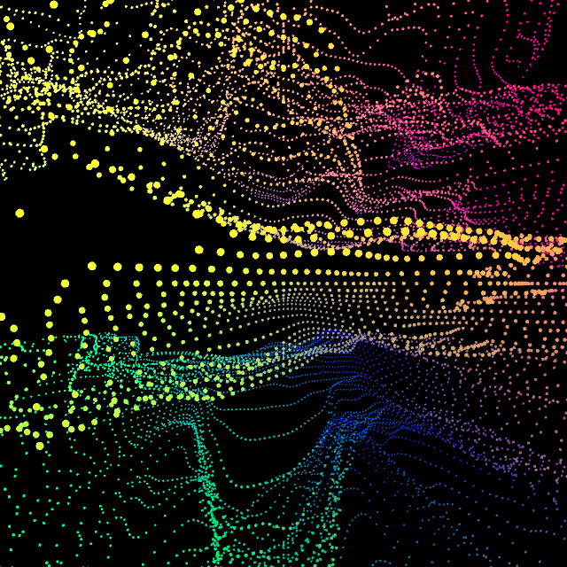
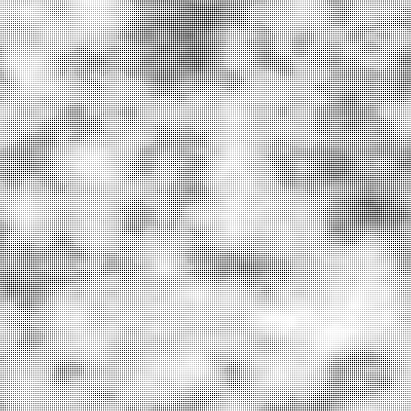

# jiyu0564_9103_tut02_quiz8

## Part1: Imaging Technique Inspiration
Josh Davis' studio's work inspired me. In image 1, dots of different colors form a dynamic dot structure. The visual effect of different shapes can be created by varying the size and color of points at different distances. Lines formed by individual points fluctuate gently, and I can generate different visual effects for my project by changing their position and color. The image 2 shows a dynamic mountain. It simulates the texture of mountains, oceans, or flows, unlike image 1, which is entirely points. An immersive visual experience is created by smooth changes in graphic texture.

Image1

Image2

## Part2: Coding Technique Exploration
I can achieve the image in part 1 by using the Perlin noise in p5.js. Perlin noise produces smooth, gradual transitions between values instead of sharp, jagged ones. This is great for creating naturally flowing patterns, like the mountains and smooth wavy dots in part 1. Using noise() can generate smooth, natural changes that affect the position and size of objects in the grid, achieving the visual effect I want.

Screenshots of coding technology

Link to example code
(https://p5js.org/examples/repetition-noise/)

Perlin Noise and p5.js Tutorial
(https://thecodingtrain.com/tracks/noise/noc/perlin/intro-to-perlin-noise)
